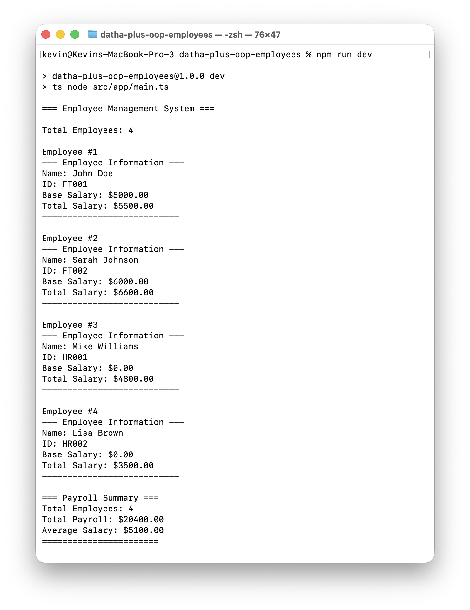
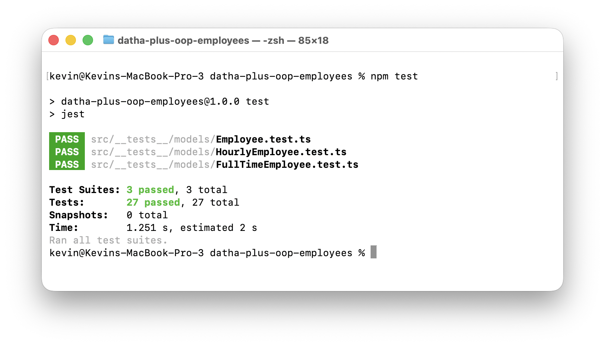

<p align="center">
  
</p>

<p align="center">
  
  
  
</p>

<h1 align="center">Employee Management System</h1>

A simple yet robust employee management system built with TypeScript, showcasing core Object-Oriented Programming (OOP) principles.

---

## Features

- Full OOP implementation (Encapsulation, Inheritance, Polymorphism, Abstraction)  
- Abstract base class: `Employee`  
- Two employee types: Full-time & Hourly  
- Automatic salary calculation + Payroll summary  
- Input validation  
- Unit tests with Jest  
- Clean, maintainable project structure  

---

## What is this?

This system manages employee information for a company with two types of workers:

- **Full-time employees** → base salary + 10% bonus  
- **Hourly employees** → hours worked × hourly rate  

The design demonstrates clean code, class inheritance, and polymorphism to calculate salaries through a shared interface.

---

## Why TypeScript?

TypeScript adds static typing to JavaScript, improving:

- Early bug detection  
- Readability & maintainability  
- Better OOP modeling  
- Developer tooling & IDE support  

Its typing system strengthens object-oriented development, making business logic safer and easier to maintain.

---

## 📂 Project Structure

```

src/
├── models/              # Employee class definitions
│   ├── Employee.ts      # Base abstract class
│   ├── FullTimeEmployee.ts
│   ├── HourlyEmployee.ts
│   └── index.ts         # Clean exports
├── app/
│   └── main.ts          # Application entry point
└── **tests**/
└── models/          # Unit tests for each class

````

---

## How it works

A base class `Employee` holds the common properties and behavior for all employees.

Two subclasses specialize salary rules:

| Type | Description |
|------|-------------|
| FullTimeEmployee | Adds 10% salary bonus |
| HourlyEmployee   | Hours worked × hourly rate |

Polymorphism allows both types to be treated uniformly through the base class when calculating payroll.

---

## OOP Concepts Demonstrated

| Concept       | Usage |
|----------------|-------|
| **Abstraction** | `Employee` is abstract and defines shared structure |
| **Inheritance** | Specialized classes extend `Employee` |
| **Polymorphism** | Salary calculated through shared interface |
| **Encapsulation** | Private data + getters / setters |

---

## Getting Started

### ✅ Requirements
- Node.js 18+
- npm

### ✅ Installation

```bash
npm install
````

### ✅ Run

```bash
npm run dev
```

### ✅ Build

```bash
npm run build
npm start
```

### ✅ Test

```bash
npm test
npm run test:coverage
```

---

## ✅ Example Output

```
Full-time: John Doe → $1100
Hourly: Jane Smith → $600

Total payroll: $1700
```

---

## Development Notes

* All inputs are validated (no empty names, no negative salaries)
* Private fields enforce encapsulation
* Error handling for edge cases
* Unit tests included with Jest
* Clean code & naming conventions applied

---

## Future Improvements

* Persist data using a database
* CLI or REST API layer
* Attendance and leave tracking
* Data validation with Zod

---

## Author

Developed by **Kevin Sailema**
As part of a technical challenge for **DathaPlus**


## Sample Output

Below is an example of the program execution:

<p align="center">
  
</p>

## Unit Tests

Below is a screenshot showing the unit tests running successfully:

<p align="center">
  
</p>
